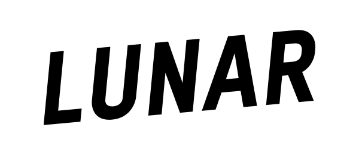

<div align="center">
  

  # qrlogo

  **Aesthetic QR codes that embed a logo or text by construction, not overlay.**

  Built on the linearity of Reed–Solomon over GF(2).
</div>

---

`qrlogo` generates QR codes whose dark/light modules *already* form your image, while still decoding to your URL on any standard scanner. Instead of stamping a logo on top of a finished QR and hoping error-correction recovers the URL, the QR is **solved** so the desired modules come out the way you want — the QArt technique (Russ Cox) at Version 40.

## Features

- **Construction, not overlay.** The logo *is* the QR; nothing is pasted on top.
- **Version 40 / EC level M.** A 177×177 grid with up to ~18 000 free bits to spend on imagery.
- **Image or text targets.** PNG/JPEG/GIF logos, or rendered text glyphs.
- **Deterministic output.** Same URL + same target → byte-identical PNG.
- **Halo support.** A 1-cell light ring around dark logo pixels keeps the artwork legible against the noisy QR data field.
- **Zero runtime dependencies** outside the Go standard library and `golang.org/x/image`.

## How it works

```diagram
╭───────────╮   ╭────────────╮   ╭───────────────╮   ╭───────╮
│  /render  │──▶│ Target map │──▶│    /engine    │──▶│  PNG  │
│ image →   │   │  (B/W/?)   │   │ build system  │   ╰───────╯
│  pixels   │   ╰────────────╯   │   + solve     │
╰───────────╯                    ╰───────┬───────╯
                                         ▲
╭───────────╮   ╭────────────╮           │
│   /qr     │──▶│ Ghost grid │───────────╯
│  URL +    │   │  (linear   │
│  vars     │   │   forms)   │           ▲
╰───────────╯   ╰────────────╯           │
                              ╭──────────┴──────────╮
                              │      /bitset        │
                              │ GF(2) Gauss–Jordan  │
                              ╰─────────────────────╯
```

Every module of the QR matrix is expressed as a linear form `c ⊕ x_{i₁} ⊕ … ⊕ x_{iₘ}` over the free padding bits. Black/White cells in the target map become equations; the GF(2) solver assigns the free bits so the data region matches as much of the image as the algebra allows.

## Requirements

- Go 1.25 or later

## Install

```sh
go install github.com/rumo-lunar/qrlogo/cmd/qrlogo@latest
```

…or clone and build locally:

```sh
git clone https://github.com/rumo-lunar/qrlogo.git
cd qrlogo
go build ./cmd/qrlogo
```

## Quick start (CLI)

```sh
# Plain QR with your URL only
qrlogo -url "https://lunar.app" -out qr.png

# QR that visually embeds a logo
qrlogo -url "https://lunar.app" -image assets/logo.png -out qrlogo.png

# QR that embeds rendered text
qrlogo -url "https://lunar.app" -text "HI" -out qrtext.png
```

### CLI flags

| Flag           | Default      | Description                                                                  |
|----------------|--------------|------------------------------------------------------------------------------|
| `-url`         | *(required)* | Byte-mode payload (≤ 2331 bytes).                                            |
| `-image`       | `""`         | Path to PNG/JPEG/GIF logo image. Mutually exclusive with `-text`.            |
| `-text`        | `""`         | Text to embed as logo. Mutually exclusive with `-image`.                     |
| `-out`         | `qrlogo.png` | Output PNG path (`-` for stdout).                                            |
| `-scale`       | `8`          | Pixels per QR module.                                                        |
| `-quiet`       | `4`          | Quiet-zone modules around the symbol.                                        |
| `-threshold`   | `0x8000`     | Luminance cutoff for image thresholding `[0, 65535]`.                        |
| `-no-halo`     | `false`      | Skip the 8-neighbour halo around dark logo cells.                            |
| `-logo-scale`  | `1.0`        | Fraction of the QR grid the logo fills, in `(0, 1]`. Logo is centred.        |
| `-best-effort` | `false`      | Skip contradicting constraints instead of failing (good for dense logos).    |
| `-stats`       | `false`      | Print synthesis stats to stderr.                                             |

Exit codes:

| Code | Meaning                                                          |
|------|------------------------------------------------------------------|
| `0`  | Success.                                                         |
| `1`  | Invalid arguments (missing `-url`, mutually exclusive flags, …). |
| `2`  | Invalid input (oversized URL, unreadable image, …).              |
| `3`  | Synthesis failed (over-constrained without `-best-effort`).      |
| `4`  | Output write failed.                                             |

> [!TIP]
> If a dense logo over-constrains the solver, pass `-best-effort` to silently drop contradicting equations and approximate the image instead of erroring.

## Quick start (library)

```go
package main

import (
    "image/png"
    "os"

    "github.com/rumo-lunar/qrlogo/engine"
    "github.com/rumo-lunar/qrlogo/render"
)

func main() {
    // 1. Build a 177×177 target map from any image.
    f, _ := os.Open("logo.png")
    defer f.Close()
    src, _ := png.Decode(f)
    target := render.FromImage(src, 177, 177, render.ImageOptions{
        IgnoreTransparent: true,
    })
    render.ApplyHalo(target)

    // 2. Synthesize a V40-M QR symbol whose modules approximate the target.
    res, err := engine.Synthesize(engine.Options{
        URL:    "https://lunar.app",
        Target: target,
    })
    if err != nil {
        panic(err)
    }

    // 3. Write the PNG (default scale 8 px/module, quiet zone 4 modules).
    out, _ := os.Create("qrlogo.png")
    defer out.Close()
    _ = res.EncodePNG(out, engine.PNGOptions{})
}
```

> [!NOTE]
> `engine.Synthesize` accepts `Target: nil`, in which case it produces a plain V40-M QR symbol carrying just the URL.

## Contract

| Parameter        | Value                          |
|------------------|--------------------------------|
| QR version       | **40**                         |
| Module grid      | **177 × 177** (31 329 modules) |
| Error correction | **M** (Medium, ~15%)           |
| Encoding mode    | **Byte**                       |
| Max URL length   | **2331 bytes**                 |
| Mask             | **2** (fixed)                  |
| Output           | PNG, 1 bit per module          |

Other QR versions, alphanumeric/Kanji modes, and print or sticker robustness are out of scope.

## The math

### Reed–Solomon is linear over GF(2)

QR codes use Reed–Solomon over `GF(256) = GF(2)[x] / (x⁸ + x⁴ + x³ + x² + 1)`. The encoder treats data codewords as polynomial coefficients, multiplies by `xᵏ`, and divides by a fixed generator polynomial — the EC codewords are the remainder.

All of those operations are **linear** in the input bytes. Each byte is an 8-dim vector over GF(2); multiplication by any fixed GF(256) element is a fixed 8×8 GF(2) matrix. Polynomial division is built from such multiplications and XORs.

So every output bit `b` of the data + EC stream is:

```
b = c ⊕ x_{i₁} ⊕ x_{i₂} ⊕ … ⊕ x_{iₘ}
```

where `c ∈ {0, 1}` is the contribution of the URL bits and the `x_{iⱼ}` are free padding bits. In code (`/qr/sym`), every ghost module is a `Bit{Vars []uint64, Const byte}`.

### Masking is constant

Data masks XOR a fixed boolean pattern over the data region. This only flips the `Const` term — no new variables, no nonlinearity. Mask 2 is `col mod 3 == 0`.

### From image to equations

For every `Black`/`White` cell `(x, y)` we emit one GF(2) row:

```
x_{i₁} ⊕ … ⊕ x_{iₘ} = wantBit ⊕ Const
```

`DontCare` cells emit nothing. Function-pattern cells (finders, timing, alignment, format info, version info, dark module) are spec-fixed and silently skipped — `Stats.FunctionConflicts` reports how many target cells landed on a wrong-polarity function bit.

### The solver

Gauss–Jordan over GF(2), `[]uint64`-row XORs:

1. **Forward elimination.** For each pivot column, find a row with a 1 there and XOR it into every other row with a 1 in that column. Row XOR is `O(n/64)` `uint64` ops.
2. **Consistency check.** A row of the form `0 = 1` means the constraints over-ran the budget → inconsistent.
3. **Back-substitution.** Each pivot row yields one variable; unpivoted variables default to the deterministic noise seed.

The solution vector feeds back into the symbolic forms (`sym.ResolveBit`) to give the concrete 177×177 module grid.

## Capacity budget

At V40-M the spec gives **2334** data codewords (`18 × 47 + 31 × 48`), **1372** EC codewords (`49 × 28`), **3706** total, **0** remainder bits.

A URL of length `N` bytes uses `4 + 16 + 8N + 4` bits of framing + payload. The remaining padding codewords are the **free variables** the solver can spend on imagery:

```
free padding bits = (2334 − N − 3) × 8
```

A 50-byte URL leaves over 18 000 free bits — plenty for a recognisable logo on the 177×177 grid.

## Project layout

```
qrlogo/
├── bitset/         GF(2) Gauss–Jordan solver
├── qr/             V40-M symbolic encoder + function-pattern bits
│   ├── gf256/      GF(256) field arithmetic
│   └── sym/        linear-form Bit and Byte over GF(2)
├── render/         text/image → 177×177 target map + halo
├── engine/         pipeline + PNG output
└── cmd/qrlogo/     CLI entry point
```

## Development

Every commit is verified by:

```sh
go vet -copylocks=false ./... && go test ./... -count=1
```

> [!NOTE]
> A round-trip scannability test through a real QR decoder is still TODO.

## References

- Russ Cox — [*QArt Codes*](https://research.swtch.com/qart)
- ISO/IEC 18004:2015 — QR code symbology specification
- Thonky — [*QR Code Tutorial*](https://www.thonky.com/qr-code-tutorial/)
- [`rsc.io/qr`](https://pkg.go.dev/rsc.io/qr) — Russ Cox's reference Go QR implementation
- [`github.com/makiuchi-d/gozxing`](https://github.com/makiuchi-d/gozxing) — Go port of ZXing, candidate for the future round-trip decode test
